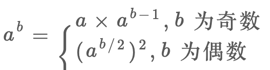

<!--
 * @Author: tangdaoyong
 * @Date: 2021-02-20 16:15:48
 * @LastEditors: tangdaoyong
 * @LastEditTime: 2021-02-20 16:28:12
 * @Description: 幂运算
-->
# 幂运算

## mod 运算

由于计算机的编码方式，形如 `(a * b) % base` 这样的运算，乘法的结果可能导致溢出，我们希望找到一种技巧，能够化简这种表达式，避免溢出同时得到结果。
比如在二分查找中，我们求中点索引时用 `(l+r)/2` 转化成 `l+(r-l)/2`，避免溢出的同时得到正确的结果。
那么，说一个关于模运算的技巧吧，毕竟模运算在算法中比较常见：
`(a * b) % k = (a % k)(b % k) % k`
证明很简单，假设：
`a = Ak +B；b = Ck + D`
其中 `A,B,C,D` 是任意常数，那么：
`ab = ACk^2 + ADk + BCk +BD`
`ab % k = BD % k`
又因为：
`a % k = B；b % k = D`
所以：
`(a % k)(b % k) % k = BD % k`
综上，就可以得到我们化简求模的等式了。
换句话说，`对乘法的结果求模，等价于先对每个因子都求模，然后对因子相乘的结果再求模`。

## 高效求幂



```ts
/**
 * @description: 求幂
 * @param {number} N
 * @param {number} M
 * @return {number}
 */
function power(N: number, M: number): number {
    // 特殊处理
    if (M <= 0) {
        return 1;
    }
    if (M % 2 === 1) {// 奇数
        return N * power(N, M - 1);
    } else {// 偶数
        let K = power(N, M / 2)
        return K * K
    }
}
```