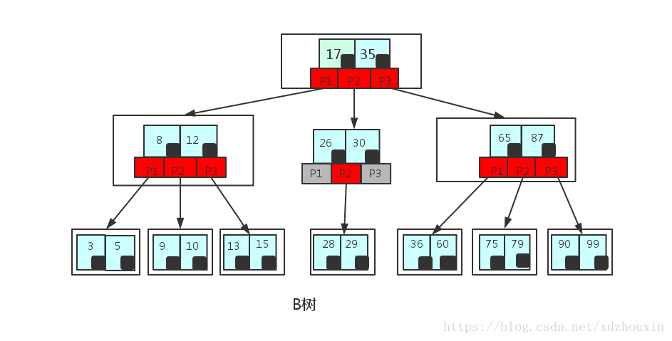
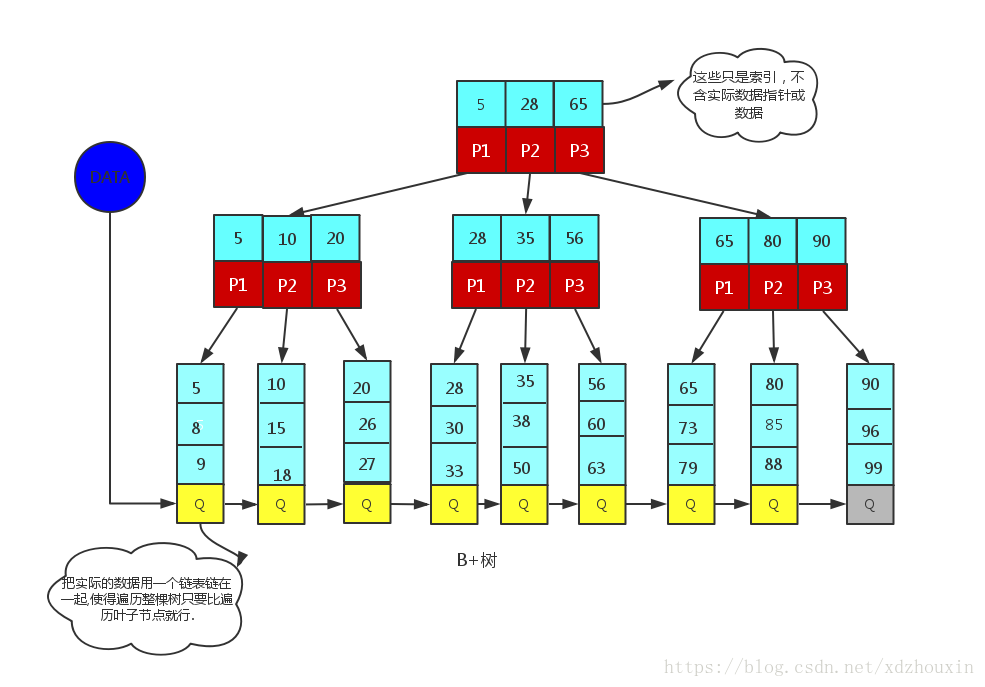

<!--
 * @Author: tangdaoyong
 * @Date: 2021-02-19 11:20:02
 * @LastEditors: tangdaoyong
 * @LastEditTime: 2021-02-23 09:13:59
 * @Description: 树
-->
# 树

[数据结构中各种树](https://www.cnblogs.com/maybe2030/p/4732377.html)
[树结构大全](https://blog.csdn.net/qq_34719188/article/details/83927460)
[红黑树(一)之 原理和算法详细介绍](https://www.cnblogs.com/skywang12345/p/3245399.html)
[一步一步写平衡二叉树（AVL树）](http://www.cppblog.com/cxiaojia/archive/2012/08/20/187776.html)
[b+树图文详解](https://blog.csdn.net/qq_26222859/article/details/80631121)
[数据结构之B-树、B+树](https://blog.csdn.net/xdzhouxin/article/details/80015424)

[LeetCode tree练习](https://leetcode-cn.com/tag/tree/)

## 介绍

树是一种抽象数据类型（ADT）或是实现这种抽象数据类型的数据结构，用来模拟具有树状结构性质的数据集合。它是由 n(n>0)n(n>0) 个有限节点组成一个具有层次关系的集合。
把它叫做「树」是因为它看起来像一棵倒挂的树，也就是说它是根朝上，而叶朝下的。

它具有以下的特点：

* 每个节点都只有有限个子节点或无子节点；
* 没有父节点的节点称为根节点；
* 每一个非根节点有且只有一个父节点；
* 除了根节点外，每个子节点可以分为多个不相交的子树；
* 树里面没有环路。

1. 二叉树
2. 二叉查找树
3. 平衡二叉树
3.1 平衡查找树之AVL树
3.2 平衡二叉树之红黑树
4. B树
5. B+树
6. B*树
7. Trie树

[系列文章](https://www.jianshu.com/u/8bcd823f7b49)

## 二叉搜索树（Binary Search Tree）

[二叉搜索树（Binary Search Tree）](https://www.jianshu.com/p/ff4b93b088eb)

## B-树

B-树就是B树，没有所谓的B减树
B树（Balance Tree）

B树的概念是为了解决一些现实问题而提出的，当数据量太大时，而内存中又无法存储这么多的数据，那么就需要将数据存储在磁盘上，如果继续采用平衡树的方法就会带来一些问题，平衡树每个节点都会分为两个节点，那么当数据太大的时候，树的高度也会不断增减，IO操作的次数也随之增加，所以需要降低树的高度，所以才有了一个节点存储多个数据的B树的方案。

B-树
B-树其实就是B树，B树是一种多路平衡搜索树（非二叉），若其是M路，则：

任意非叶子节点最多可以有M个子女，且M>2；
根节点的子女数为[2,M]；
除了根节点以外的非叶子节点的子女数目为M/2（取上整）个到M个；
每个节点存放至少M/2-1（取上整）和至多M-1个键值（至少两个）；
非叶子节点的关键字个数=指向子女的指针个数-1；
非叶子节点的关键字K[1],K[2],…,K[M-1]且有K[i] < K[i+1]；
非叶子节点的指针P[1],P[2],…,P[M]；其中P[1]指向关键字小于K[1]的子树，P[M]指向关键字大于K[M-1]的子树，其他P[i]指向关键字属于(K[i-1],K[i])的子树；
所有叶子节点都位于同一层。
B树与二叉搜索树的最大区别在于其每个节点可以存不止一个键值，并且其子女不止两个，不过还是需要满足键值数=子女数-1。因此，对于相同数量的键值，B树比二叉搜索树要更加矮一些，特别是当M较大时，树高会更低。

B-树的插入
B树的插入首先查找插入所在的节点，若该节点未满，插入即可，若该节点以及满了，则需要将该节点分裂，并将该节点的中间的元素移动到父节点上，若父节点未满，则结束，若父节点也满了，则需要继续分裂父节点，如此不断向上，直到根节点，如果根节点也满了，则分裂根节点，从而树的高度+1。

B-树的删除
B树的删除首先要找到删除的节点，并删除节点中的元素，如果删除的元素有左右孩子，则上移左孩子最右节点或右孩子最左节点到父节点，若没有左右孩子，则直接删除。删除后，若某节点中元素数目不符合B树要求（小于M/2-1取上整），则需要看起相邻的兄弟节点是否有多余的元素，若有，则可以向父节点借一个元素，然后将最丰满的相邻兄弟结点中上移最后或最前一个元素到父节点中（有点类似于左旋）。若其相邻兄弟节点没有多余的元素，则与其兄弟节点合并成一个节点，此时也需要将父节点中的一个元素一起合并。

B+树
B+树主要是应文件系统所需而产生的。文件系统中，文件的目录是一级一级索引，只有最底层的叶子节点（文件）保存数据。非叶子节点只保存索引，不保存实际的数据，数据都保存在叶子节点中，所有的非叶子节点都可以看成是索引部分。

B+树是B树的一个变种，其也是一种多路平衡搜索树，其与B树的主要区别是：

非叶子节点的指针数量与关键字数量相等；
非叶子节点的子树指针P[i]，指向关键字值属于[K[i],K[i+1]）的子树（B树是开区间，B+树是左闭右开，也就是说B树不允许关键字重复，而B+树允许）；
所有关键字都在叶子节点出现，所有的叶子节点增加了一个链指针（稠密索引，且链表中的关键字切好是有序的）；
非叶子节点相当于是叶子节点的索引（稀疏索引），叶子节点相当于是存储数据的数据层。

B+树的插入
B+树的插入与B树类似，如果节点中有多余的空间放入元素，则直接插入即可。如果节点本来就已经满了，则将其分裂为两个节点，并将其中间元素的索引放入到父节点中，在这里如果是叶子节点的话，是拷贝中间元素的索引到父节点中（因为叶子节点需要包含所有的元素），而如果是非叶子节点，则是上移节点的中间元素到父节点中。

B+树的删除
在叶节点中删除元素，如果节点还满足B+树的要求，则okay。如果元素个数过少，并且其邻近兄弟节点有多余的元素，则从邻近兄弟节点中借一个元素，并修改父节点中的索引使其满足新的划分。如果其邻近兄弟节点也没有多余的元素，则将其和邻近兄弟节点合并，并且我们需要修改其父节点的索引以满足新的划分。并且如果父节点的索引元素太少不满足要求，则需要继续看起兄弟节点是否多余，如果没有多余则还需要与兄弟节点合并，如此不断向上，直到根节点。如果根节点中元素也被删除，则把根节点删除，并由合并来的节点作为新的根节点，树的高度减1。

B-树和B+树的区别
B+树的非叶子节点并没有指向关键字具体信息的指针，因此其内部节点相对B树更小，如果把所有同一内部节点的关键字存放在同一盘块中，盘块所能容纳的关键字数量也越多，具有更好的空间局部性，一次性读入内存的需要查找的关键字也越多，相对的IO读写次数也就降低了。

另外对于B+树来说，因为非叶子节点只是叶子节点中关键字的索引，所以任何关键字的查找都必须走一条从根节点到叶子节点的路，所有关键字查询的路径长度相同。而若经常访问的元素离根节点很近，则B树访问更迅速，因为其不一定要到叶子节点。

数据库索引采用B+树的主要原因是B树在提高了IO性能的同时并没有解决元素遍历效率低下的问题，而也正是为了解决该问题，B+树应运而生。因为叶子节点中增加了一个链指针，B+树只需要取遍历叶子节点可以实现整棵树的遍历。而且数据库中基于范围的查询是非常频繁的，B树对基于范围的查询效率太低。