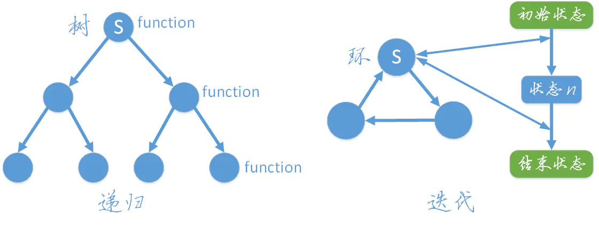
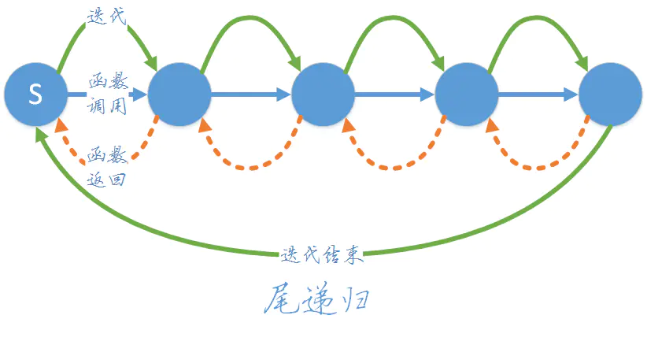

<!--
 * @Author: tangdaoyong
 * @Date: 2021-03-01 09:31:43
 * @LastEditors: tangdaoyong
 * @LastEditTime: 2021-03-16 14:20:39
 * @Description: 迭代与递归
-->
# 迭代与递归

[迭代与递归](https://www.jianshu.com/p/32bcc45efd32)

## 递归

`递归（recursion）`：递归常被用来描述以自相似方法重复事物的过程，在数学和计算机科学中，指的是在函数定义中使用函数自身的方法。（A调用A）
递归是一个`树结构`，从字面可以其理解为重复“递推”和“回归”的过程，当“递推”到达底部时就会开始“回归”，其过程相当于树的深度优先遍历。

## 迭代

`迭代（iteration）`：重复反馈过程的活动，每一次迭代的结果会作为下一次迭代的初始值。（A重复调用B）
迭代是一个`环结构`，从初始状态开始，每次迭代都遍历这个环，并更新状态，多次迭代直到到达结束状态。

## 对比

`递归（recursion）`：递归常被用来描述以自相似方法重复事物的过程，在数学和计算机科学中，指的是在函数定义中使用函数自身的方法。（A调用A）
`迭代（iteration）`：重复反馈过程的活动，每一次迭代的结果会作为下一次迭代的初始值。（A重复调用B）
理论上递归和迭代时间复杂度方面是一样的，但实际应用中（函数调用和函数调用堆栈的开销）递归比迭代效率要低。



## 递归转迭代

理论上递归和迭代可以相互转换，但实际从算法结构来说，递归声明的结构并不总能转换为迭代结构（原因有待研究）。`迭代可以转换为递归，但递归不一定能转换为迭代`。

将递归算法转换为非递归算法有两种方法，
* 一种是直接求值（迭代），不需要回溯
* 另一种是不能直接求值，需要回溯。
前者使用一些变量保存中间结果，称为直接转换法，后者使用栈保存中间结果，称为间接转换法。

### 直接转换法

直接转换法通常用来消除尾递归（tail recursion）和单向递归，将递归结构用迭代结构来替代。（`单向递归` → `尾递归` → `迭代`）

### 间接转换法

递归实际上利用了系统堆栈实现自身调用，我们通过使用栈保存中间结果模拟递归过程，将其转为非递归形式。

尾递归函数递归调用返回时正好是函数的结尾，因此递归调用时就不需要保留当前栈帧，可以直接将当前栈帧覆盖掉。


## 实例

### 

以斐波那契数列的求解为例：

1. 递归解
```ts
/**
 * 递归得到斐波那契数
 * @param n 
 */
function fibonacci_recursion(n: number): number {
    // n = 0, 1时给出recursion终止条件
    if (n <= 1) {
        return n
    }
    return fibonacci_recursion(n - 1) + fibonacci_recursion(n - 2)
}
```

2. 迭代解
```ts
/**
 * 迭代得到斐波那契数
 * @param n 
 */
function fibonacci_iteration(n: number): number {
    // n = 0, 1时给出recursion终止条件
    if (n <= 1) {
        return n
    }
    let temp = 0, temp1 = 0, temp2 = 1
    for (let i = 2; i <= n; i++) {
        temp = temp1 + temp2
        temp1 = temp2
        temp2 = temp
    }
    return temp
}
```
前端接入用户中心当前开发流程
- [ 1] 官方网站下载对应版本的keycloak项目
- [ 2] 本地运行keycloak,在theme 主题下拷贝base主题对应需求做更改
- [ 3] 在keycloak后台配置client 和用户
- [ 4] 在keycloak后台配置对应client登录成功以后的跳转地址，即本地项目地址http://localhost:…
- [ 5] 在keycloak后台下载client对应的keycloak.json文件
- [ 6] github下载keycloak前端接入包demo项目，将keycloak.json文件放入项目中
- [ 7] 运行本地Demo项目，正常会跳转keycloak登录页面
- [ 8] 登录成功以后跳转回demo项目index.js页面
- [ 9] 项目的keycloak.json配置，开始是写在每个模块中的（每次修改都需要更改），昨天让后台添加了一个接口，现在从后台获取keycloak的配置。

后续改bug流程：
- [ 1] 在本地的keycloak项目中修改theme主题相关代码，本地运行
- [ 2] 拷贝theme主题到用户中心github项目，推代码，自动部署